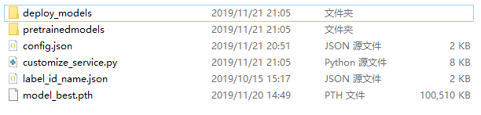

## Requirements
* Pytorch 1.3.0 
* Torchvision 0.4.0
* Python3.7
* pretrainedmodels
* Chinese font-simhei.ttf, [Download Link](https://fontzone.net/download/simhei). Put simhei in `progect_root/font`.

## How to run
### Clone Our Project
```bash
git clone https://github.com/XiangqianMa/AI-Competition-HuaWei.git
cd AI-Competition-HuaWei
```

### Prepare Dataset
Download dataset, unzip and put them into `your_data_path` directory.

Structure of the `your_data_path` folder can be like:
```bash
train_data
label_id_name.json
```

Create soft links of datasets in the following directories:

```bash 
cd AI-Competition-HuaWei
mkdir data
cd data
ln -s your_data_path huawei_data
```

### HuaWei Cloud Online Test

We use `online-service` folder to accomplish online test on HuaWei ModelArts platform.  The struct of this folder is like the following:

You should put your dependencies into `online-service/model`，like this:



If you want to import customized package in your code, import sentence should be like this:

```python
from model import xxx
```

Also, you must specified your dependencies in `config.json`:

```python
"dependencies": [
    {
        "installer": "pip",
        "packages": [
            {
                "package_name": "Pillow",
                "package_version": "5.0.0",
                "restraint": "EXACT"
            },
            {
                "package_name": "torchvision",
                "package_version": "0.2.1",
                "restraint": "EXACT"
            },
            {
                "package_name": "tqdm"
            }                
        ]
    }
]
```

## Train

```bash
cd AI-Competition-HuaWei
python train_classifier.py
```